# Project 1: LAMP STACK IMPLEMENTATION
# EC2 instance
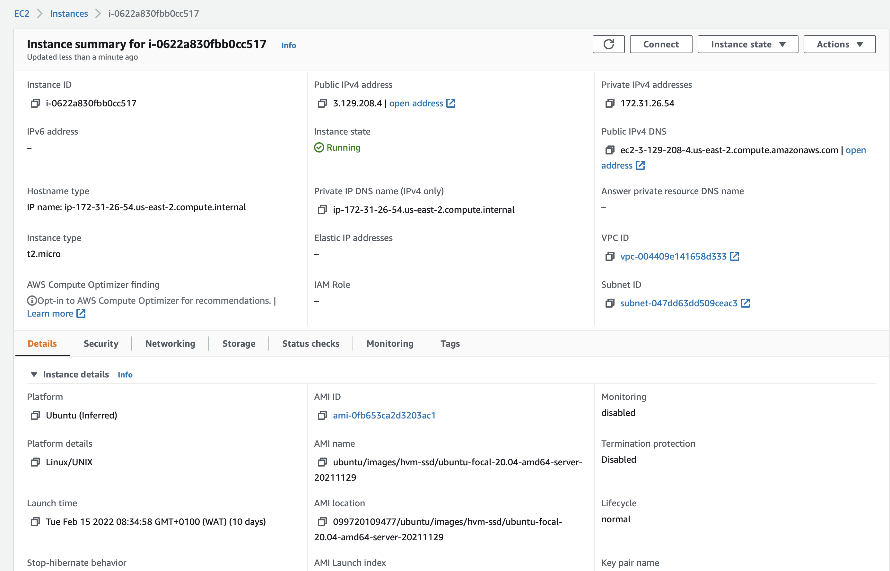

# Connecting to EC2 using MacOs terminal
ß
# Location of the pem file
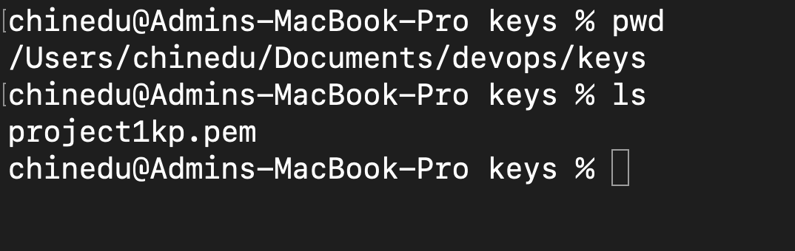
ß
# Changing the premissions for the private key file
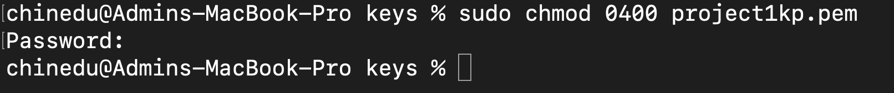

# Connecting to my instance

# STEP 1: Installing Apache web server
# updating a list of packages in package manager

# running apache2 package installation

# Confirming that Apache is running

# Opening port 80 in my EC2 instance
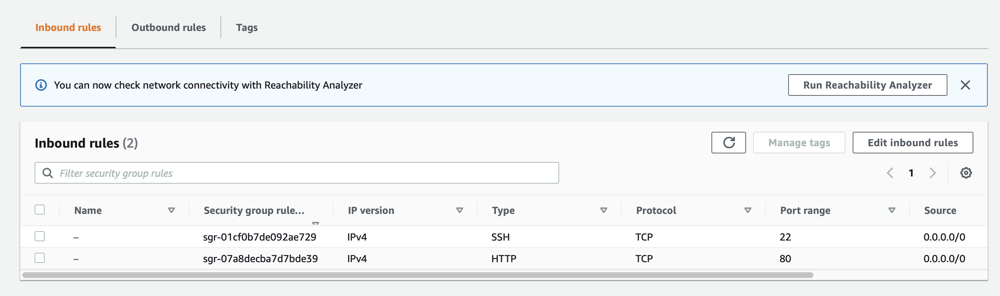

# It Worksss

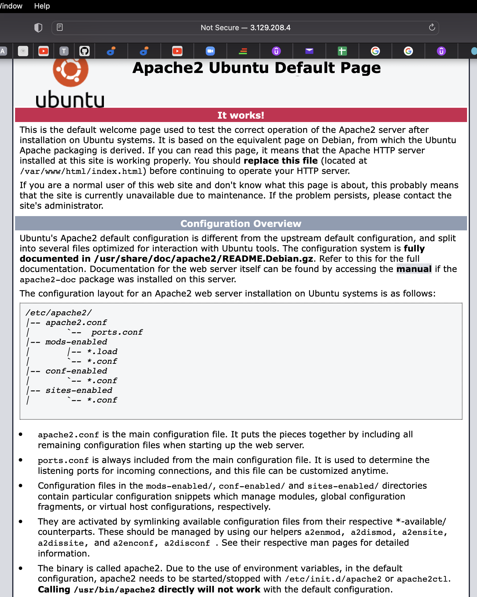

# STEP 2: INSTALLING MYSQL DATABASE
# Running the installation package
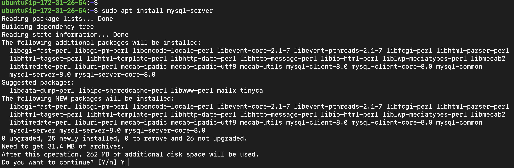

# Connecting to MySql Server
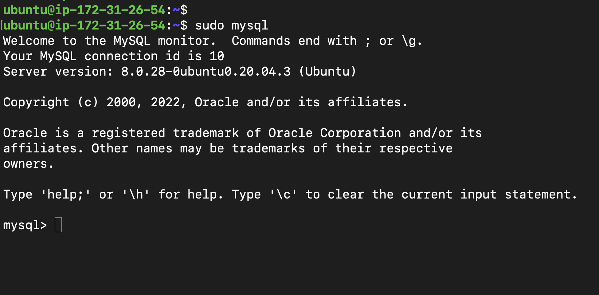

# STEP 3: Installing PHP
# Installing packages (PHP, PHP-mysql and libapache2-mod-php)
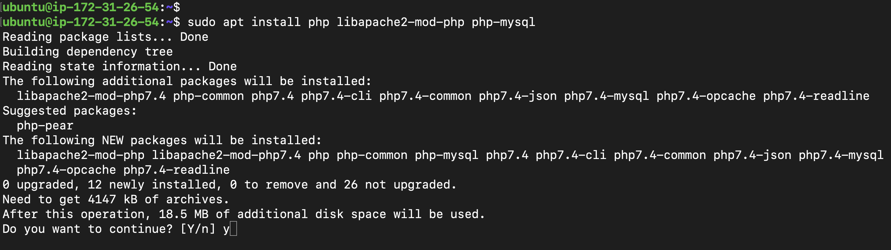

# Checking php version after installation
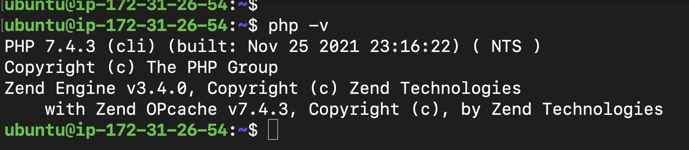

# STEP 4: CREATING A VIRTUAL HOST FOR YOUR WEBSITE USING APACHE
# Creating a dir called projectlamp in the /var/www dir
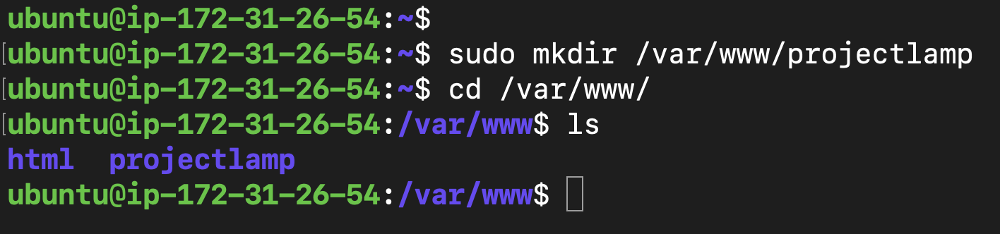

# Commands to create a file
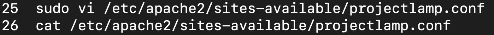
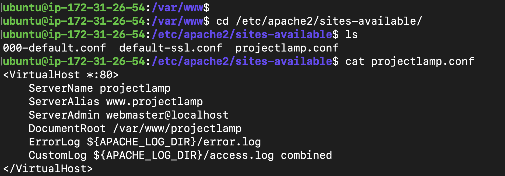

# Other commands
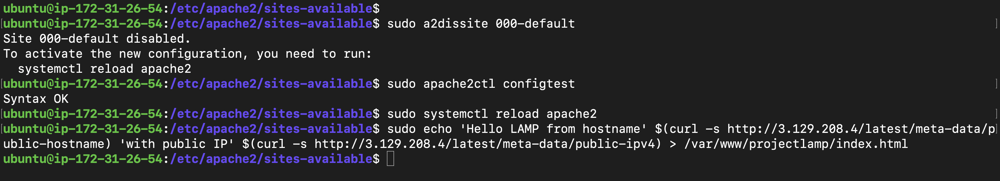

# Final
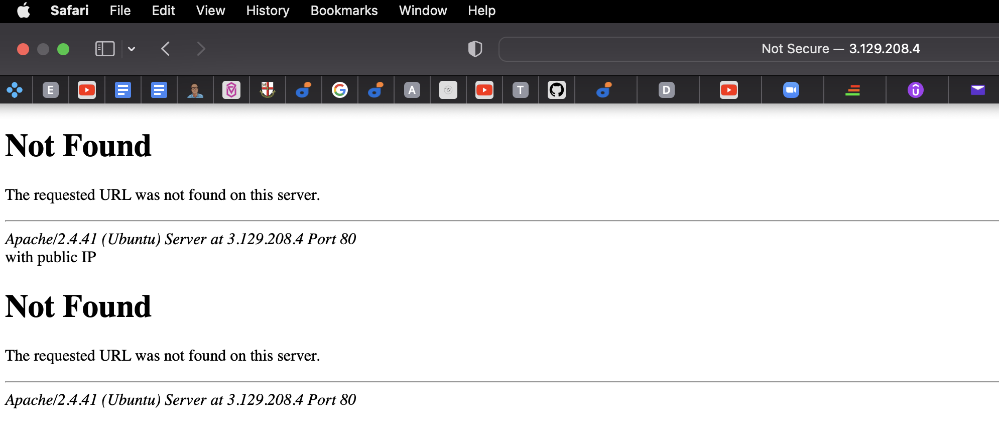

# Step 5: Enable PHP on the Website
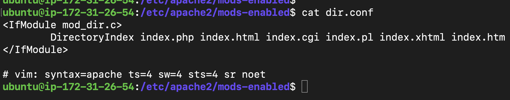
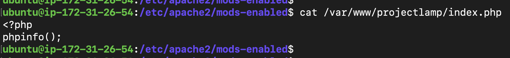
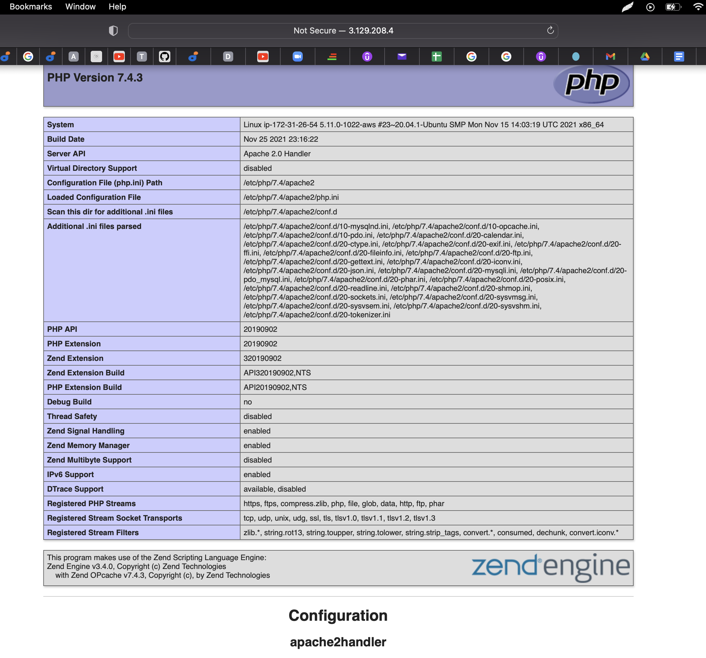