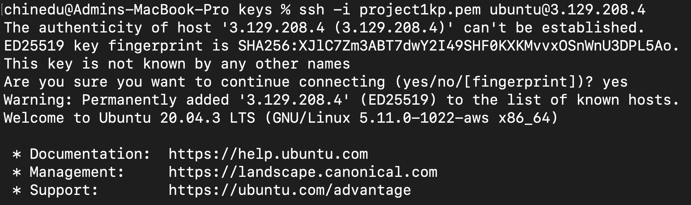
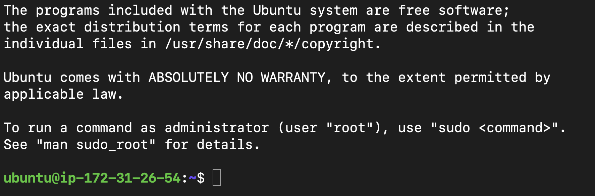
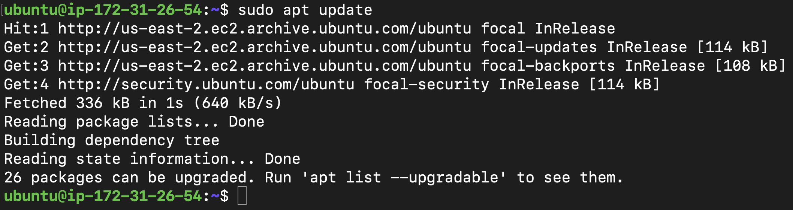
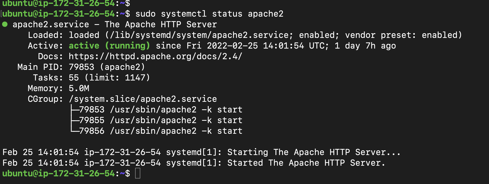

# My first project1
# EC2 instance

# Connecting to EC2 using MacOs terminal
ß
# Location of the pem file

ß
# Changing the premissions for the private key file

# Connecting to my instance

# Installing Apache web server
# updating a list of packages in package manager

# running apache2 package installation

