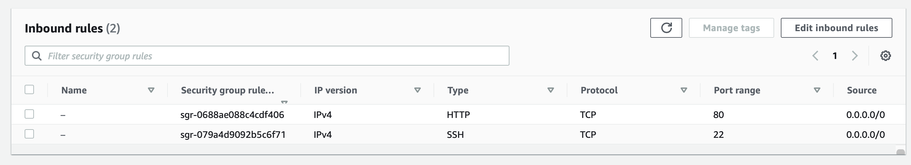
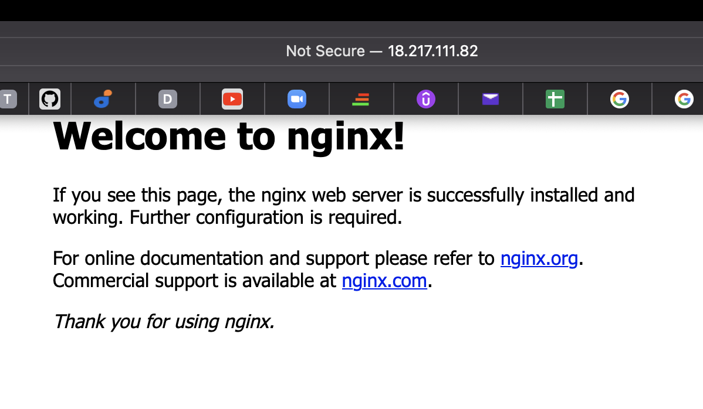
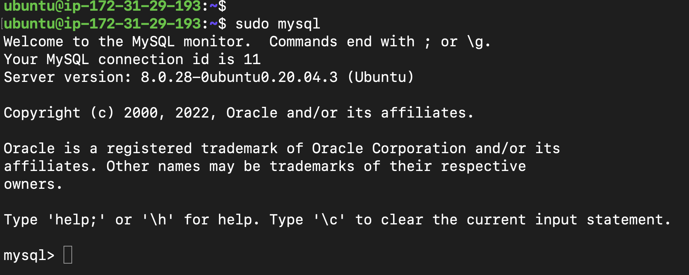
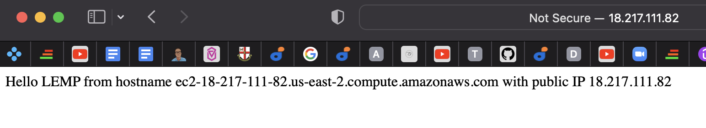

# PROJECT 2: WEB STACK IMPLEMENTATION (LEMP STACK)
## STEP 1: Installing nginx web server
To install ngnix, I ran the below commands on new ubuntu server
1) sudo apt update
2) sudo apt install nginx

I checked the status of my installation with the command
> sudo systemctl status nginx

## Opening port 80

To test the application,
> curl http://localhost:80

Calling the app on my web browser
> http://18.217.111.82:80

## STEP 2: Installing MySql
Commands:
1) sudo apt install mysql-server
2) sudo mysql_secure_installation
3) sudo mysql

4) exit

## STEP 3: Installing PHP
Installing the needed packages:
1) php-fpm(PHP fastCGI process manager): tells Nginx to pass PHP requests to this software for processing
2) php-mysql: PHP module that allows PHP to communicate with MySQL-based databases

command:
> sudo apt install php-fpm php-mysql

## STEP 4: Configuring Nginx to use PHP processor
COMMANDS:
1) sudo mkdir /var/www/projectLEMP

