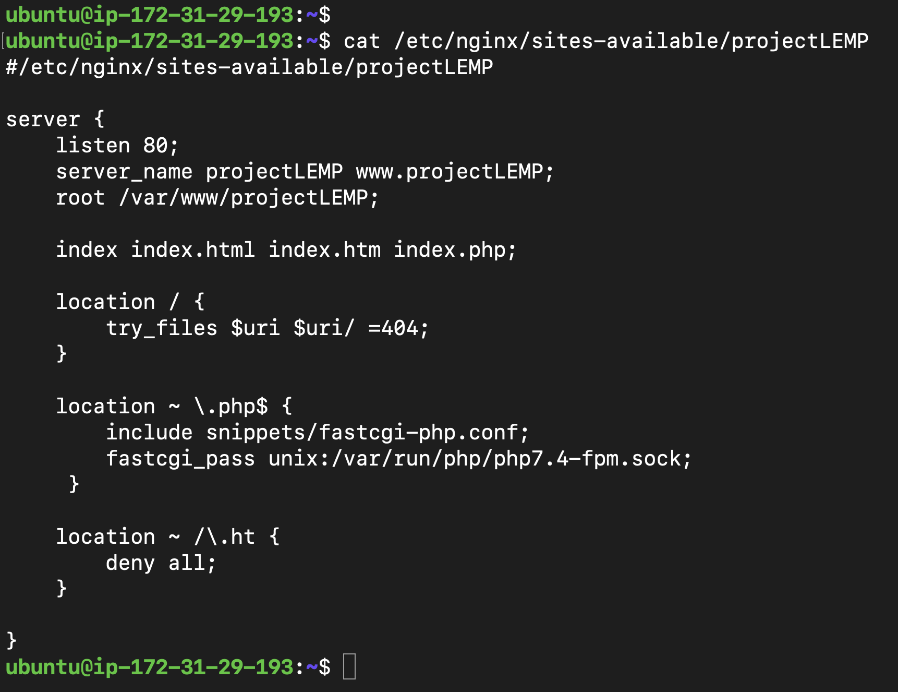

# PROJECT 2: WEB STACK IMPLEMENTATION (LEMP STACK)
## STEP 1: Installing nginx web server
To install ngnix, I ran the below commands on new ubuntu server
1) sudo apt update
2) sudo apt install nginx

I checked the status of my installation with the command
> sudo systemctl status nginx

## Opening port 80

To test the application,
> curl http://localhost:80

Calling the app on my web browser
> http://18.217.111.82:80

## STEP 2: Installing MySql
Commands:
1) sudo apt install mysql-server
2) sudo mysql_secure_installation
3) sudo mysql

4) exit

## STEP 3: Installing PHP
Installing the needed packages:
1) php-fpm(PHP fastCGI process manager): tells Nginx to pass PHP requests to this software for processing
2) php-mysql: PHP module that allows PHP to communicate with MySQL-based databases

command:
> sudo apt install php-fpm php-mysql

## STEP 4: Configuring Nginx to use PHP processor
COMMANDS:
1) sudo mkdir /var/www/projectLEMP
2) sudo chown -R $USER:$USER /var/www/projectLEMP
3) sudo nano /etc/nginx/sites-available/projectLEMP
4) cat /etc/nginx/sites-available/projectLEMP

Here’s what each of these directives and location blocks do:

1) listen — Defines what port Nginx will listen on. In this case, it will listen on port 80, the default port for HTTP.
2) root — Defines the document root where the files served by this website are stored.
3) index — Defines in which order Nginx will prioritize index files for this website. It is a common practice to list index.html files with a higher precedence   than index.php files to allow for quickly setting up a maintenance landing page in PHP applications. You can adjust these settings to better suit your application needs.
4) server_name — Defines which domain names and/or IP addresses this server block should respond for. Point this directive to your server’s domain name or public IP address.
5) location / — The first location block includes a try_files directive, which checks for the existence of files or directories matching a URI request. If Nginx cannot find the appropriate resource, it will return a 404 error.
6) location ~ \.php$ — This location block handles the actual PHP processing by pointing Nginx to the fastcgi-php.conf configuration file and the php7.4-fpm.sock file, which declares what socket is associated with php-fpm.
7) location ~ /\.ht — The last location block deals with .htaccess files, which Nginx does not process. By adding the deny all directive, if any .htaccess files happen to find their way into the document root ,they will not be served to visitors.

