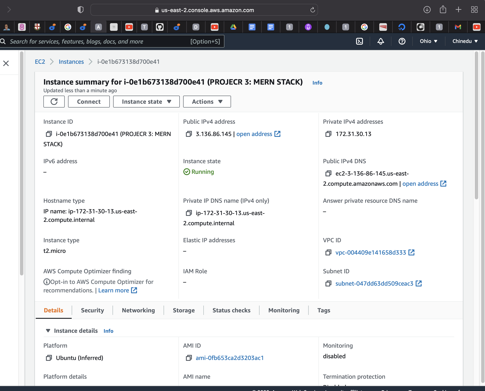
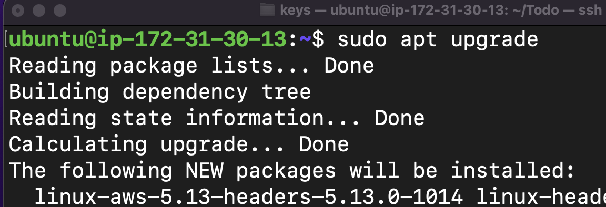
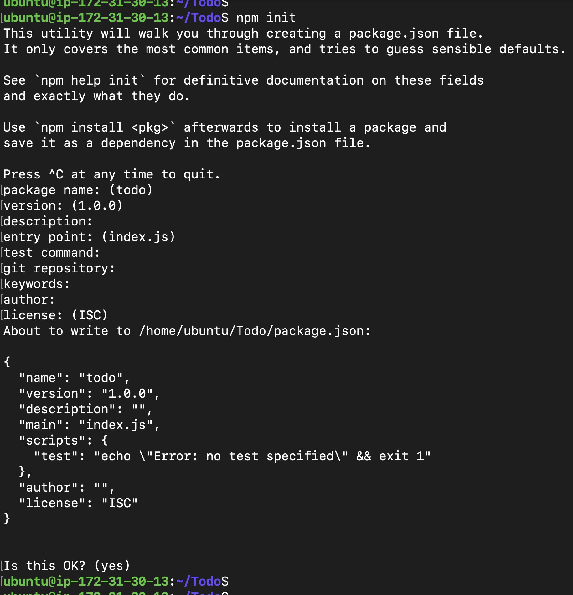
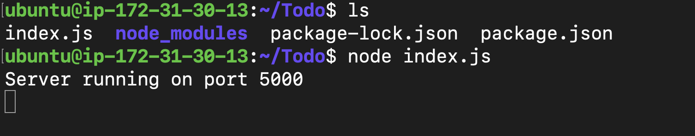
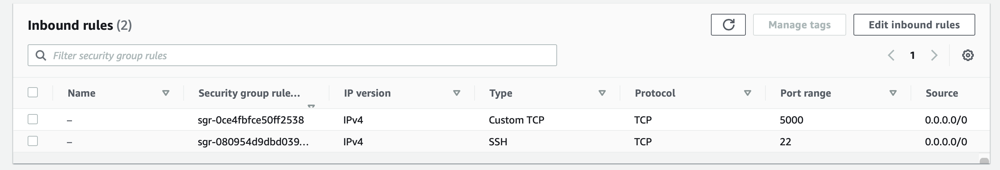
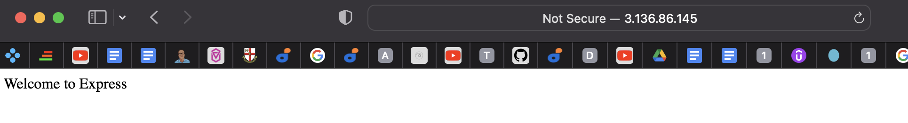
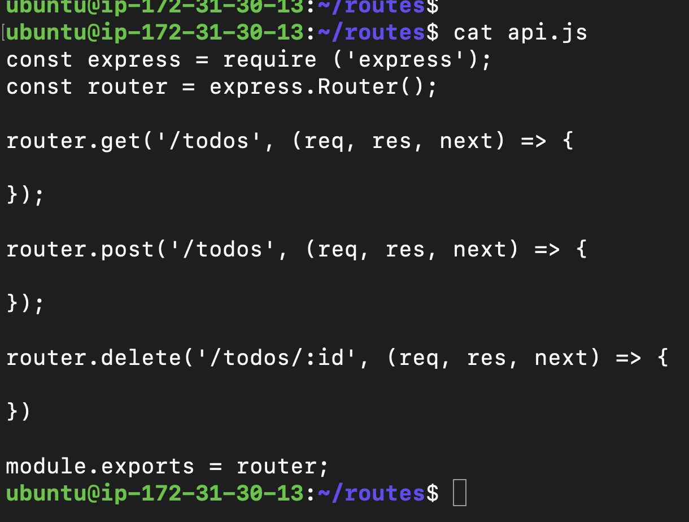
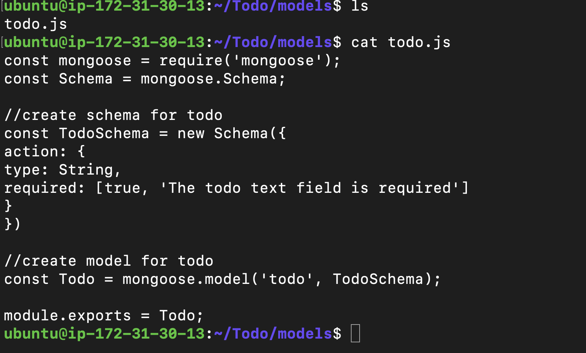
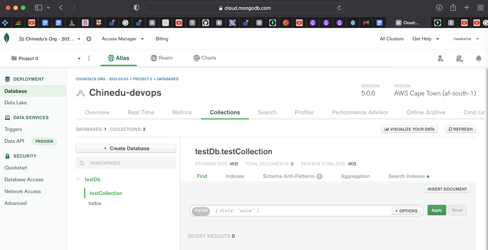
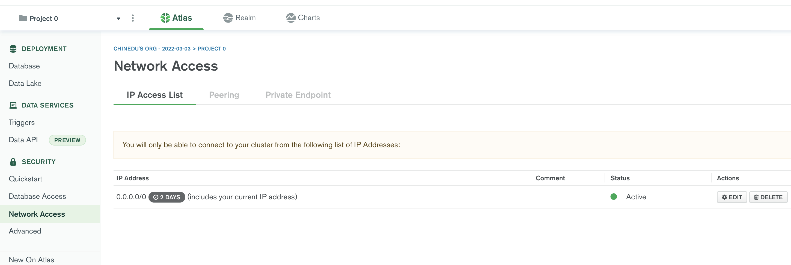

# PROJECT 3: MERN STACK IMPLEMENTATION

MERN Web stack consists of following components:

1) MongoDB: A document-based, No-SQL database used to store application data in a form of documents.
2) ExpressJS: A server side Web Application framework for Node.js.
3) ReactJS: A frontend framework developed by Facebook. It is based on JavaScript, used to build User Interface (UI) components.
4) Node.js: A JavaScript runtime environment. It is used to run JavaScript on a machine rather than in a browser.

# STEP 0: Server Set up

# Step 1: Backend configuration
Update and upgrde the ubuntu server

Commands:
1) sudo apt update
2) sudo apt upgrade

Getting the location of Node.js software from Ubuntu repositories.
Command:
1) curl -sL https://deb.nodesource.com/setup_12.x | sudo -E bash -

Installing node.js
Command:
1) sudo apt-get install -y nodejs

Verify the node installation 
node -v

Verify the node installation
npm -v

Creating a directory  for To-Do project
mkdir Todo
cd Todo
npm init

Start the application; in the Todo directory, run the command below
1) node index.js

Opening port 5000 in EC2 platform

Calling the url
http://3.136.86.145:5000

There are three actions that our To-Do application needs to be able to do:

Create a new task
Display list of all tasks
Delete a completed task

creating routes, we execute the below commands:
1) mkdir routes
2) cd routes
3) touch api.js
4) vi api.js

## Models

Models make javaScript applications interactive with the database. It is used to create shemas of the database whhich are basically a blueprint of how the database will be constructed, including other data fields that may not be required to be stored in the database.

To create a model and a schema, we need to install mongoose
A Node.js package that makes working with mongodb easier.
Commands:

1) npm install mongoose
2) mkdir models && cd models && touch todo.js

## MongoDb Database

>> Creating network access:

The image shows that any IP can connect to my cluster. I have done this because it is a test environment. In a production environment, I would grant access to the autorized IPs.