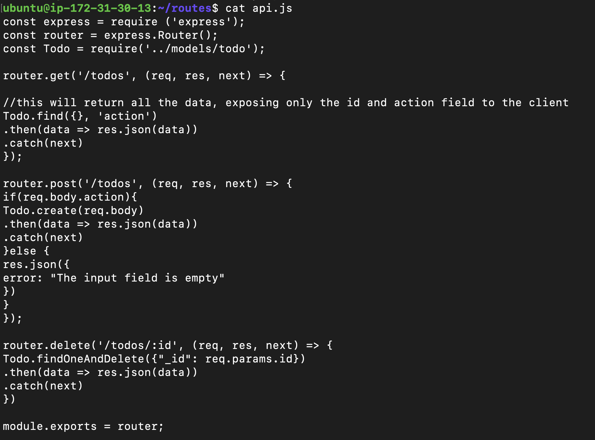

# PROJECT 3: MERN STACK IMPLEMENTATION

MERN Web stack consists of following components:

1) MongoDB: A document-based, No-SQL database used to store application data in a form of documents.
2) ExpressJS: A server side Web Application framework for Node.js.
3) ReactJS: A frontend framework developed by Facebook. It is based on JavaScript, used to build User Interface (UI) components.
4) Node.js: A JavaScript runtime environment. It is used to run JavaScript on a machine rather than in a browser.

# STEP 0: Server Set up

# Step 1: Backend configuration
Update and upgrde the ubuntu server

Commands:
1) sudo apt update
2) sudo apt upgrade

Getting the location of Node.js software from Ubuntu repositories.
Command:
1) curl -sL https://deb.nodesource.com/setup_12.x | sudo -E bash -

Installing node.js
Command:
1) sudo apt-get install -y nodejs

Verify the node installation 
node -v

Verify the node installation
npm -v

Creating a directory  for To-Do project
mkdir Todo
cd Todo
npm init

Start the application; in the Todo directory, run the command below
1) node index.js

Opening port 5000 in EC2 platform

Calling the url
http://3.136.86.145:5000

There are three actions that our To-Do application needs to be able to do:

Create a new task
Display list of all tasks
Delete a completed task

creating routes, we execute the below commands:
1) mkdir routes
2) cd routes
3) touch api.js
4) vi api.js

## Models

Models make javaScript applications interactive with the database. It is used to create shemas of the database whhich are basically a blueprint of how the database will be constructed, including other data fields that may not be required to be stored in the database.

To create a model and a schema, we need to install mongoose
A Node.js package that makes working with mongodb easier.
Commands:

1) npm install mongoose
2) mkdir models && cd models && touch todo.js

## MongoDb Database

>> Creating network access:

The image shows that any IP can connect to my cluster. I have done this because it is a test environment. In a production environment, I would grant access to the autorized IPs.

.env file

updating the index.js to reflect the use of .env so that Node.js can connect to the database.

Starting the server
1) node index.js

Using Postman to execute a POST request

Using Postman to execute a GET request

Using Postman to execute a DELETE request
To run a delete request, we need to pass the ID of the entry we want to delete as an argument to the url
e.g URL: http://3.136.86.145:5000/api/todos/{ID}

So to delete our second data, I will use the below url
"http://3.136.86.145:5000/api/todos/6227ff94f36fe9c135e0b1e4"

Now when we run our GET request again, the data has been deleted:

# We have successfully created our Backend.

# Step 2: Frontend creation

Creating the "client" directory with create-react-app.
Command:
1) npx create-react-app client (Creates a dir "client" in the Todo dir)

Installing Dependencies:
1) Install concurrently(Used to run multiple commands simultaneously from the same terminal window)

npm install concurrently --save-dev

2) Install nodemon (It runs and monitors the server for changes; if found, it will restart the server and load the new changes)

npm install nodemon --save-dev

Editting the package.json file in the Todo directory:

Editting the package.json file in the client directory to add "proxy": "http://localhost:5000":

In the Todo dir, run the command below;
1) npm run dev

After this, in the EC2 instance, open up port 3000, then the app can be called through port 3000;

http://3.136.86.145:3000

Creating React components

Inside the src folder of the clients directory, a sub-directory was created;

mkdir components

and the below files were created in it

touch Input.js ListTodo.js Todo.js

and the files where filled with relevant codes.

Input.js

ListTodo.js

Todo.js

Installing Axios
In ReactJS, Axios is a library that serves to create HTTP requests that are present externally.

In the client folder;

npm install axios

In the src folder, the below files where also created:

App.js

App.css

index.css

After all changes, in the Todo directory, start the app by running the command:

npm run dev

when the app starts, call the url
http://<public-ip>:3000
http://3.136.86.145:3000

