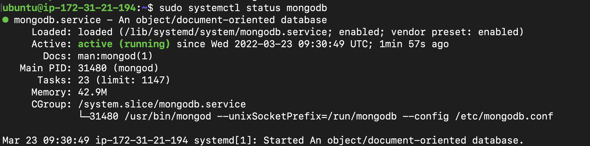
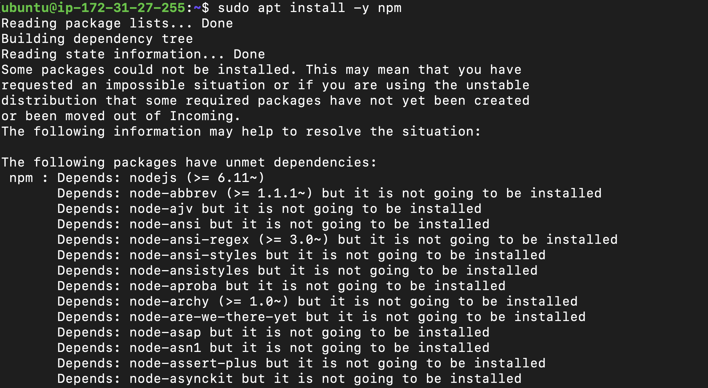
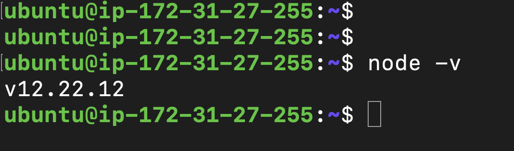
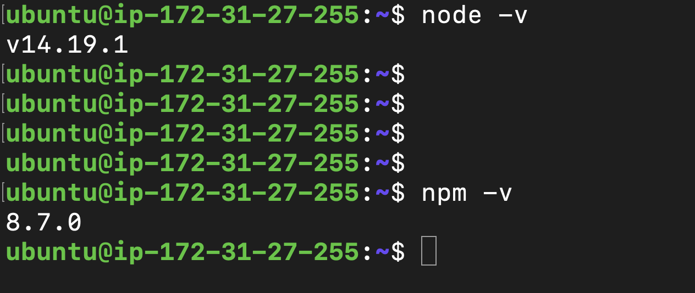
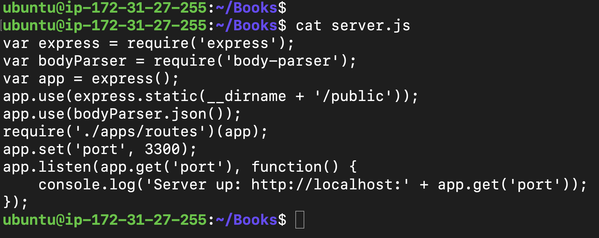

# MEAN STACK IMPLEMENTATION
## STEP 0

## STEP 1: Installing NodeJs

Commands:

1  sudo apt update.

2  sudo apt upgrade

3  sudo apt -y install curl dirmngr apt-transport-https lsb-release ca-certificates

4  curl -sL https://deb.nodesource.com/setup_12.x | sudo -E bash -

5  sudo apt install -y nodejs

6  sudo node -v

## Step 2: Installing MongoDB
MongoDB stores data in flexible, JSON-like documents.
To install MongoDB, the below command were used

1 sudo apt-key adv --keyserver hkp://keyserver.ubuntu.com:80 --recv 0C49F3730359A14518585931BC711F9BA15703C6

2 echo "deb [ arch=amd64 ] https://repo.mongodb.org/apt/ubuntu trusty/mongodb-org/3.4 multiverse" | sudo tee /etc/apt/sources.list.d/mongodb-org-3.4.list

3 sudo apt install -y mongodb

4 sudo service mongodb start

5 sudo systemctl status mongodb

The steps above installs mongoDB, starts the service and verifies the status

# Installing Node package Manager
To install npm, you run the command below:

1 sudo apt install -y npm

but on running the command, I got the error below:

I checked my node version and it was 12.

After upgrading my node, I still had same error, then I followed the steps found on the link below

https://www.codegrepper.com/code-examples/javascript/upgrade+node+12+to+14+ubuntu

and I was able to install npm

# Installing body-parser package (helps in processing JSON files passed in requests to the server.)

1 sudo npm install body-parser

# Creating a folder Books and initialinzing npm project in it

1 mkdir Books && cd Books

2 npm init
(This creates the package.json file)

Adding the server.js file

