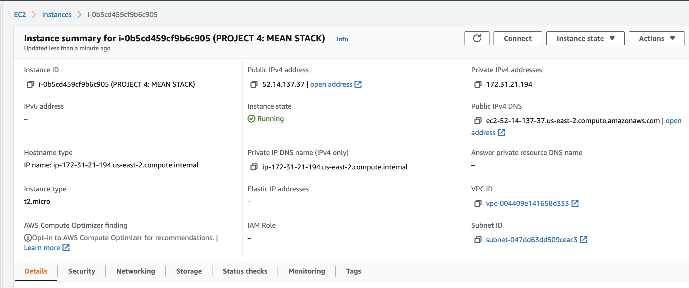

# MEAN STACK IMPLEMENTATION
## STEP 0

## STEP 1
Installing NodeJs

Commands:

1  sudo apt update.
2  sudo apt upgrade
3  sudo apt -y install curl dirmngr apt-transport-https lsb-release ca-certificates
4  curl -sL https://deb.nodesource.com/setup_12.x | sudo -E bash -
5  sudo apt install -y nodejs
6  sudo node -v

